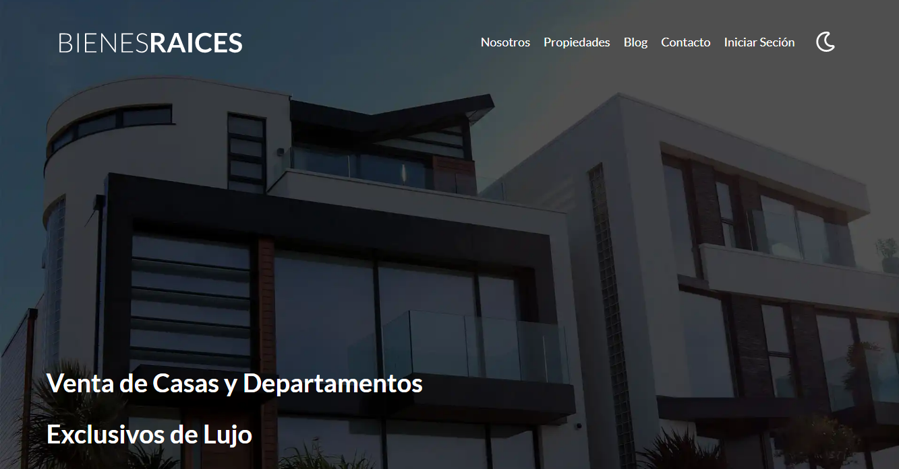
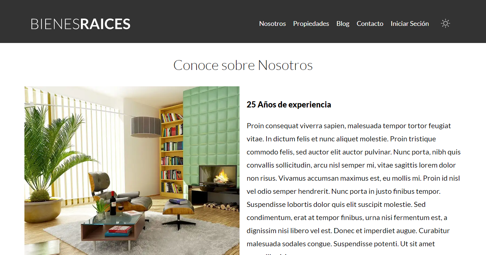
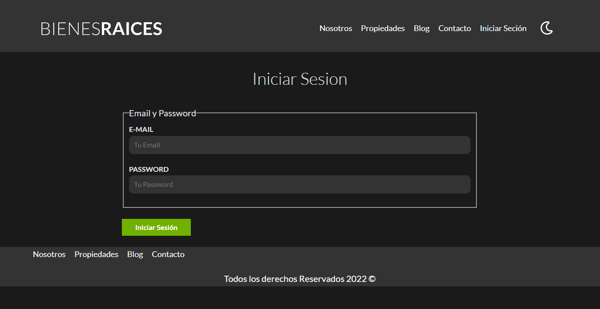
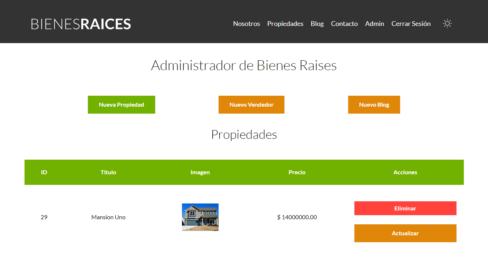
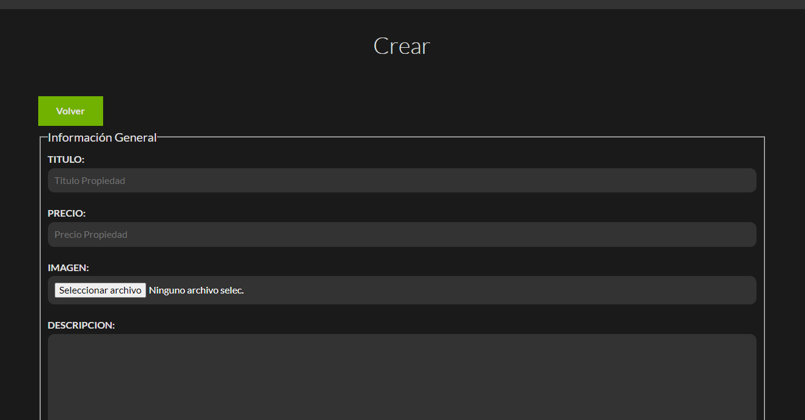
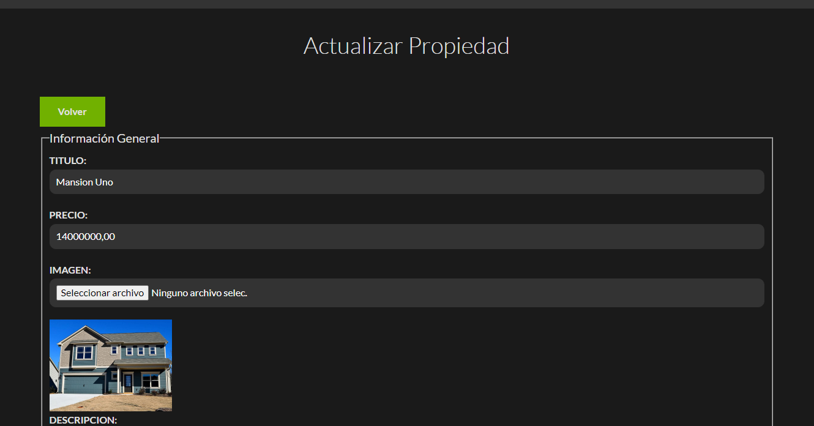

# Schema for Real State

Instalar Dependencias

``` npm install ```

Para ver en servidor local

``` Abrir CMD ```
Acceder a la carpeta public

Ejemplo : 
```C:\laragon\www\bienesRaicesMVC\public ```

Iniciar Proyecto en servidor PHP 

``` php -S localhost:3000 ```

## MVC (Model View Controller)

La carpeta Public es donde estar todo lo que todos pueden vicitar y visualizar
y solo ahi podran acceder

Nuestras Clases seran ahora nuestros Modelos en PHP 8.0

Para el envio de Emails usamos phpmailer

### CARPETAS 

* Controllers: Guardamos los controladores
* Includes: Guardamos Funciones y llamada a la BDD
* Modelos: Guardamos los modelos o OBJETOS con su Clase y Metodos
* Public: Guardamos los archivos del frontend y la plantilla de los diferentes Modulos
* SRC: Archivos del frontend preprocesados
* Views: Guardamos las platillas de los views y la plantilla general Layout

## Documentacion de Funcionalidad

### Model

Nuestro modelo se encuentra en el harchivo ./Router.php en conjunto con public/Index.php

##### Router.php: 

Contiene una clase que funcionara como delegador de rutas GET y constructor de una
vista principal

En dicho archivo se encuentra nuestras variables rutas GET y rutas POST, que a su vez son 
arreglos que almacenan RUTAS y FUNCIONES, las cuales son construidas por sus respectivas 
funciones get y post : Estas funciones reciben una URL como Index y una FUNCION como Valor

La funcion primera es la funcion 

ComprobarRutas() 
    Cosas que realiza :

    > Iniciar sesion

    > Comprovar que la sesion este logeada

    > Integrar un arreglo de rutas protegidas

    > Traer la URL actual 

    > Verificar el metodo (GET o POST)

    > Mediante un IF hacer una u otra cosa dependiendo del metodo
        > Basicamente crea un filtro ( lo almacena en la funcion $fn ) y verifica que la ruta 
          actual recibida, coincida con las rutas integradas al arreglo 

    > Mediante un IF se comprueba que si al ruta es protegida (mediante la funcion in_array que 
      comrueba que este en una arreglo) o si el usuario no esta autenticado, entonces sera 
      relocado al inicio

    > Por ultimo si la variable $fn creada en el filtro es true o existe
        > y entonces manda a llamar una funcion integrada llamada 
          call_user_func : Es una funcion que nos va a permitir llamar una funcion que no savemos 
          como se llamara

          Este recibe dos parametros, la funcion actual $fn o funcion asociada
          y $this contiene la demas informacion del arreglo y de la clase router

La funcion Segunda es la funcion render()
    La cual que encarga de recibir el $view y los datos que se iteraran para el funcionamiento

    > Primero usamos un foreach para extraer los datos y redistribuir
        > Lo que hace es dibidir el arreglo en llave y valor, con la sintaxis de doble $$ 
          se transforma el Index en una Variable y le asigna su valor
    
    > Con la funcion integrada ob_start() almacenamos y guardamos en memoria el valor que se recibe

    > El view se lo pasamos a una URL dinamica que lo que hara es buscarlo en el servidor/carpeta

    > Limpiamos el archivo en memoria y lo integramos a la variable $contenido

    > $contenido sera enviado al archivo /views/layout.php que sera la
      plantilla de la vista


##### Index.php:

Este archivo contiene: 

Todo lo guardado en /includes/app.php como: las funciones, la base de datos, y nuestro Metodo principal

Las llamadas al ROUTER y a los CONTROLADORES

En este instanciamos el ruter, para poder usar las funciones las cuales se integran de la sigiente manera
+ Agregamos los metodos que tendra reprecentado por la funcion que los almacena del ROUTER
+ Le damos la direccion (El view), luego el controlador y la funcion del mismo en al que se ecuentra
  el codigo que se usara ... sintaxis ejemplo [PropiedadController::class, 'index']

Al final del archivo comprobamos las rutas


### View

Este almacena lo que se mostrara en la pantalla, son plantillas intercambiables segun la URL
estas son alimentadas por medio del los CONTROLADORES que a su vez interactua con EL ROUTER
estos envian las funciones, varibles, objetos y arreglos que se iteraran

### Controller

Los controladores interactuaran con el ROUTER y el VIEW para enviarle informacion a este mismo
Estan conformados de la siguiente manera:

Llamadas al ROUTER y a los MODELOS

Una clase Principal 

    Que contiene Metodos estaticos 

    > Reciben una instancia del Router $router
        > Dentro de ellos se encontraran las Varibles y las funcionalidades que tendra cada pagina
          como lo son:
          El envio a la Base de Datos, interacion con los modelos
          comprovaciones, arreglos y objetos
        
        > Todos estos datos seran enviados y recividos del view por medio del metodo ->render creado
          en el archivo Router.php, este recibe un arreglo y su funsion se explica en el apartado
          de -- Router.php: que esta mas arriba de este texto

    > Hay metodos que no interactuan con el ROUTER por que no tienen una vista como tal y solo
      interactuan con los modelos

## Modelos

Son objetos que interactuan principalmente con la base de datos.

Su Objeto principal es Active Record

Interactuan con SQL 

[Sobre el POO del proyecto](./models/POONotes.md)
[Sobre el Testing del proyecto](./cypress/TestingNotes.md)

## Images






